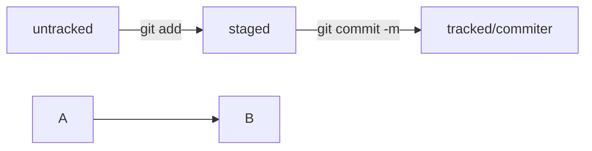

# Порядок создания репозитория

## Создаёт репозитозиторий на сайте github.com

Настройки-Репозиторрия-New

Создаём публичный репозиторий

## Создаём репозиторий на комптютере
```
mkdir ~/dev/first_case/ && cd /dev/first_case && git init 
git add -all или git add README.md
git commit -m "Создали файл README.md"
git push
```
## Одел мужик шляпу - а она какраз 


# Шпаргалка по статусу файлов
HEAD - всему голова, на которую шляпа какраз

commit - комитет 

Статусы файлов в виде кубиков:

